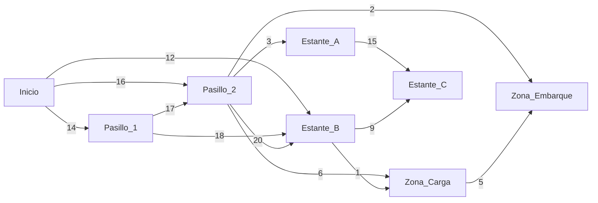
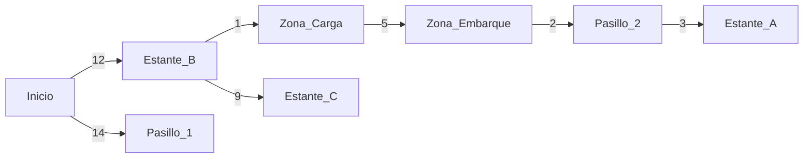

# Grafo generado aleatoriamente (Prim)

## Grafo completo

```mermaid
graph LR
  Inicio -- 16 --> Pasillo_2
  Inicio -- 14 --> Pasillo_1
  Inicio -- 12 --> Estante_B
  Pasillo_1 -- 17 --> Pasillo_2
  Pasillo_1 -- 18 --> Estante_B
  Pasillo_2 -- 20 --> Estante_B
  Pasillo_2 -- 6 --> Zona_Carga
  Pasillo_2 -- 3 --> Estante_A
  Pasillo_2 -- 2 --> Zona_Embarque
  Estante_A -- 15 --> Estante_C
  Estante_B -- 9 --> Estante_C
  Estante_B -- 1 --> Zona_Carga
  Zona_Carga -- 5 --> Zona_Embarque
```

## Árbol Parcial Mínimo (MST)

```mermaid
graph LR
  Inicio -- 12 --> Estante_B
  Estante_B -- 1 --> Zona_Carga
  Zona_Carga -- 5 --> Zona_Embarque
  Zona_Embarque -- 2 --> Pasillo_2
  Pasillo_2 -- 3 --> Estante_A
  Estante_B -- 9 --> Estante_C
  Inicio -- 14 --> Pasillo_1
```
